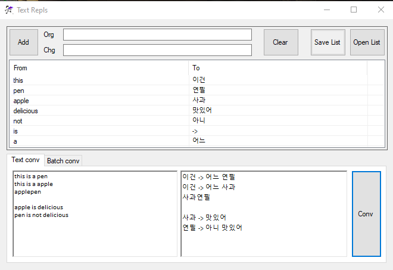

# English

## TextRepls
Multiple text replacer in text or files.

Text convert using text box or process multiple files using batch list
Warning: file processing doesn't check overwrite

## NOTIFY
Support only UTF-8 now!!!

# 한국어

## TextRepls
텍스트 또는 파일에서 여러개 문자열을 동시에 바꿀 수 있습니다

문장을 변환하던가, 파일 배치 작업을 할 수 있습니다.
다만 배치 작업은 덮어쓰기하므로 주의하십시오.

## 주의
UTF-8 밖에 지원하지 않습니다!!!
